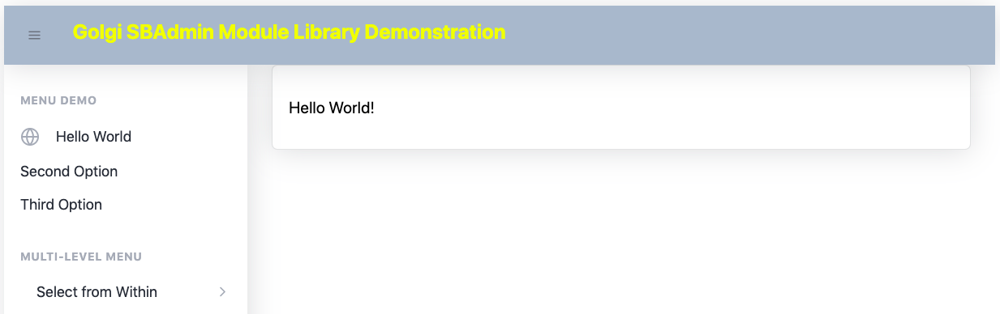

# Getting Started with the Golgi SBAdmin Module Library

## Index

- [Pre-Requisites](#pre-requisites)
- [Recommended File System Folder Structure](#recommended-file-system-folder-structure)
  - [index.html](#indexhtml)
  - [app.js](#appjs)
  - [root_assembly.js](#root_assemblyjs)
- [Try It Out](#try-it-out)
- [First Steps in Controlling the SBAdmin User Interface](#first-steps-in-controlling-the-sbadmin-user-interface)
  - [Append Targets](#append-targets)
  - [Panel Colours](#panel-colours)
    - [Background Colours](#background-colours)
    - [Text Colours](#text-colours)
- [Customising the SBAdmin Header Panel](#customising-the-sbadmin-header-panel)
  - [Adding Header Panel Text](#adding-header-panel-text)
  - [Adding The Sidebar Toggle Device](#adding-the-sidebar-toggle-device)
- [Customising the SBAdmin Footer Panel](#customising-the-sbadmin-footer-panel)
- [Customising the SBAdmin Menu Panel](#customising-the-sbadmin-menu-panel)
  - [The *sbadmin-sidebar-menu* Component](#the-sbadmin-sidebar-menu-component)
  - [The *sbadmin-sidebar-heading* Component](#the-sbadmin-sidebar-heading-component)
  - [The *sbadmin-sidebar-menu-item* Component](#the-sbadmin-sidebar-menu-item-component)
  - [Content Panel Assemblies](#content-panel-assemblies)
  - [Menu Icons](#menu-icons)
  - [Multiple Menu Options](#multiple-menu-options)
    - [*js/assemblies/content2.js*](#jsassembliescontent2js)
    - [*js/assemblies/content3.js*](#jsassembliescontent3js)
  - [Specifying A Default Menu Option](#specifying-a-default-menu-option)
  - [Multi-level Menus](#multi-level-menus)
  - [Multi-level Sub-Menus](#multi-level-sub-menus)
- [Creating Content Panels](#creating-content-panels)
  - [Cards](#cards)
    - [Getting Started with Cards](#getting-started-with-cards)
    - [Card Headers and Footers](#card-headers-and-footers)
  - [Dynamic or Generated Content](#dynamic-or-generated-content)
    - [Assembly Hooks](#assembly-hooks)
    - [The *onSelected()* LifeCycle Method](#the-onselected-lifecycle-method)
    - [Using a Golgi State-Map to Populate Cards](#using-a-golgi-state-map-to-populate-cards)
    - [Populating Content Panel Assemblies Just Once On Initial Rendering](#populating-content-panel-assemblies-just-once-on-initial-rendering)
  - [Carousels](#carousels)
  - [Forms](#forms)
    - [*/assemblies/formdemo.js*](#assembliesformdemojs)
    - [Creating a Form](#creating-a-form)
    - [Text Input Form Element](#text-input-form-element)
    - [*golgi-sbadmin* Form Element Automation](#golgi-sbadmin-form-element-automation)
    - [Adding a Button](#adding-a-button)
    - [Adding a Button Click Event Handler](#adding-a-button-click-event-handler)
    - [Examining the Automatically-Marshalled Form Data](#examining-the-automatically-marshalled-form-data)
    - [Displaying the Form Data in the Card Footer](#displaying-the-form-data-in-the-card-footer)
    - [Try Out The Form](#try-out-the-form)
    - [Other Input Form Element Types](#other-input-form-element-types)
    - [Disabled and ReadOnly Fields](#disabled-and-readonly-fields)
    - [Dynamically Setting An Input Field Value](#dynamically-setting-an-input-field-value)
    - [Detecting and Handling Changes Within a Form](#detecting-and-handling-changes-within-a-form)
    - [Textarea Field](#textarea-field)
    - [Range Field](#range-field)
    - [Select / Drop-down Menu](#select-drop-down-menu)
    - [Dynamically-Populated Select](#dynamically-populated-select)
    - [Multiple-Choice Select / Drop-down Menu](#multiple-choice-select-drop-down-menu)
    - [Dynamically-Populated Multipe-Choice Select](#dynamically-populated-multiple-choice-select)
    - [Radio Buttons](#radio-buttons)
    - [Dynamically-Defined Radio Buttons](#dynamically-defined-radio-buttons)
    - [Programmatically Checking and accessing Radio Buttons](#programmatically-checking-and-accessing-radio-buttons)
    - [Checkboxes](#checkboxes)
    - [Multiple-Choice Checkboxes](#multiple-choice-checkboxes)
    - [Dynamically-Defined Checkboxes](#dynamically-defined-checkboxes)
    - [Programmatically Checking, Unchecking and accessing Checkboxes](#programmatically-checking-unchecking-and-accessing-checkboxes)
    - [Single-Value Checkbox](#single-value-checkbox)
    - [Switches](#switches)
    - [Programmatically Checking, Unchecking and accessing Single-Value Checkboxes](#programmatically-checking-unchecking-and-accessing-single-value-checkboxes)

This tutorial will show you how you can get a basic SBAdmin User Interface up and running in a few minutes.

## Pre-Requisites

You'll need access to a web server to which you have file read/write privileges, so you can upload and modify files in its file system.

This tutorial will assume that the web server you use will have access to the open Internet (although this is not essential: the SBAdmin Module Library can be configured to work in a closed Intranet).

Otherwise, you'll just need an editor of your choice.  No build-chain or other tooling is required.

## Recommended File System Folder Structure

This tutorial will assume that you'll create a folder/file structure as follows.  This structure can be created
at either your web server's root path or, if you prefer, at any other subdirectory/path.

Golgi's browser-based run-time simply fetches the JavaScript Module files it needs when it needs them, using a simple configuration JSON object that instructs it where to find them in your web server's paths.

      |- index.html
      |
      |- js
      |   |
      |   |- app.js 
      |   |
      |   | - assemblies
      |   |      |
      |   |      |- root_assembly.js
      |   |      |
      |   |      |- ...etc

The contents of the files shown in this structure will be described below.

### *index.html*

This is the HTML page that you will load to start your SBAdmin Application.

It should contain, at the very least, the following:

        <!DOCTYPE html>
        <html lang="en">
          <head>
            <meta charset="utf-8" />
            <meta http-equiv="X-UA-Compatible" content="IE=edge" />
            <meta name="viewport" content="width=device-width, initial-scale=1, shrink-to-fit=no" />
            <title>Golgi SBAdmin Module Library Demo</title>
          </head>

          <body>
            
            
            
          </body>
        </html>

You can, of course, modify the title as desired.

Note that we're going to load the Bootstrap and Feather JavaScript library code from CDNs.  You can, of course, use local copies of these libraries from your web server if you prefer.

As you can see, everything is then controlled by the *app.js* Module that will be loaded into the browser from your web server's *js* folder.

### *app.js*

This file has three basic purposes:

- to import and load the Golgi framework module;

- to define the Golgi configuration, so that Golgi knows where to find your assemblies and the SBAdmin Components;

- to load your root Assembly, which, together with any other assemblies that it, in turn, might load, defines your specific SBAdmin User Interface and its behaviour.

Start with this simple version which implements those three functions:

        (async () => {
          const {golgi} = await import('https://cdn.jsdelivr.net/gh/robtweed/golgi/src/golgi.min.js');
          let context = {
            assemblyPath: window.location.origin + '/js/assemblies/',
            componentPaths: {
              sbadmin: 'https://robtweed.github.io/golgi-sbadmin/components/'
            }
          };
          await golgi.renderAssembly('root_assembly', 'body', context);
        })();

Notice that we're fetching Golgi itself from its Github repository, but once again, you could make a local copy on your web server.

The *context* object defines our specific Golgi configuration:  

- the assemblies, which define your specific SBAdmin User Interface, will be fetched from your Web Server (from the */js/assemblies/* folder in this instance: change as required).

- you'll notice, however, that we're going to fetch the SBAdmin Golgi Components directly from this Github repository.  You could, of course, copy them to your web server and fetch them from there instead.

Finally, we're loading our root assembly module, the contents of which we'll describe next.

### root_assembly.js

Create this file in your *js/assemblies* folder, initially containing the code shown below:

        export function load() {
          let gx=`
        <sbadmin-root />
          `;
          return {gx};
        };

So you'll see that all we're going to do, for now, is load the *sbadmin-root* Golgi Component.

Having saved this file, we're now ready to try out this initial version of your application.

## Try It Out

To try out your application, all you need to do is load the *index.html* file from your web server into your browser.

For example, assuming the web server's paths are mapped to your file system:

        https://example.com/sbadmin/index.html

You should see an empty set of SBAdmin panels:

Congratulations if you see this in your browser!  You've successfully got the SBAdmin User Interface up and running.

None of the panels are populated with your content, of course, but it's now just a case of building out your assembly files.  Everything else you've created can remain the same (though we may want to add some optimisation later).

----

## First Steps in Controlling the SBAdmin User Interface

### Append Targets

Golgi WebComponents are designed to be composable, meaning that we can embed other Golgi WebComponents within them as Child Tags.  You can also embed ordinary HTML tags.

All Golgi WebComponents have a default target element within them to which Child Components or HTML tags will be appended.  This is made available via a WebComponent property named *childrenTarget*.  Unless otherwise specified, this is the outermost HTML tag within a Golgi WebComponent, but the WebComponent developer can re-assign this to any other HTML tag within the WebComponent.

Let's see what happens if we use that with the *sbadmin-root* WebComponent.

Edit the *js/assemblies/root_assembly.js* file, adding a child *div* tag with some text to the *sbadmin-root* WebComponent as follows:

        export function load() {
          let gx=`
        <sbadmin-root>
          
Here is some text

        </sbadmin-root>
          `;
          return {gx};
        };

You can either edit the file in-situ on your web server, or edit it locally and upload it to the web server.  Remember, with Golgi there is no build step - just edit the files and re-load the application in your browser.  Note that you may need to clear the browser's cache to ensure it loads the latest versions of your files.

So, try reloading the *index.html* file in the browser.  

You should see the text appearing in the main content panel, because it is defined, within the *sbadmin-root* WebComponent, as being the *childrenTarget*.

For many WebComponents, this would be sufficient, but of course our SBAdmin User Interface has 4 panels, each of which you'll want to populate with your specific content.

To cater for such situations, Golgi allows you to define and use as many of your own Append Targets as you wish.

So, the *sbadmin-root* WebComponent has defined within it four Append Targets whose property names are:

- topbarTarget: The Header Panel
- sidebarTarget: The Left-hand Menu Panel
- footerTarget: The Footer Panel
- contentTarget: The Main Content Panel

As you've seen, you can also use the *childrenTarget* property to append content to the main Content Panel.

When adding child Components or HTML tags to a WebComponent that has custom Append Targets, you specify the Target to which you want to append the child Component, using a special attribute: *golgi:appendTo*

Let's try them out.  

Re-edit the *js/assemblies/root_assembly.js* file as follows:

        export function load() {
          let gx=`
        <sbadmin-root>
          

            Header Panel text
          

          

            Footer Panel text
          

          

            Menu Panel text
          

          

            Content Panel Text
          

        </sbadmin-root>
          `;
          return {gx};
        };

Reload the *index.html* file in the browser.  

You should now see the various lines of text appearing in each of the four SBAdmin UI Panels:

OK so we now know how to add content to each of the Panels!

### Panel Colours

#### Background Colours

Currently we're using the default background colours assigned to each of the SBAdmin UI Panels.  You may be quite happy to also use them as defined "out of the box", but you may decide you want to use different colours for one or more of the Panels.

The *sbadmin-root* WebComponent allows you to do this by making use of its built-in state object.  When you use a Golgi WebComponent within an Assembly, you can define its initial state properties simply by specifying them as attributes.

In the case of the *sbadmin-root* WebComponent, it allows you to specify four state properties:

- header_bg_color
- sidebar_bg_color
- footer_bg_color
- content_bg_color

The value can be any valid value for defining the CSS *background-color* style property, eg an RGB value.

So let's try this out.  We'll initially justrecolour the header panel.

Re-edit the *js/assemblies/root_assembly.js* file and add the *header_bg_color* attribute to the *sbadmin-root* tag as follows:

        export function load() {
          let gx=`
        <sbadmin-root header_bg_color="#aabbcc">

          

            Header Panel text
          

          

            Footer Panel text
          

          

            Menu Panel text
          

          

            Content Panel Text
          

        </sbadmin-root>
          `;
          return {gx};
        };

Reload the *index.html* file in the browser.  

The header panel should now have changed to having a grey background.

#### Text Colours

You can similarly define the text colour to be used in each panel.  These are assigned via the following state variable names:

- header_text_color
- sidebar_text_color
- footer_text_color
- content_text_color

The value can be any valid value for defining the CSS *color* style property, eg an RGB value or colour name.

So let's try this out.  We'll initially just recolour the header panel.

Re-edit the *js/assemblies/root_assembly.js* file and add the *header_text_color* attribute to the *sbadmin-root* tag as follows:

        export function load() {
          let gx=`
        <sbadmin-root header_bg_color="#aabbcc" header_text_color="white">

          

            Header Panel text
          

          

            Footer Panel text
          

          

            Menu Panel text
          

          

            Content Panel Text
          

        </sbadmin-root>
          `;
          return {gx};
        };

Reload the *index.html* file in the browser.  

The header panel should now have changed to having white text in a grey background.

----

## Customising the SBAdmin Header Panel

Rather than using simple HTML tags within the SBAdmin Header Panel, you should use the other Golgi SBAdmin WebComponents that are designed for use within it.  These include their own specific, built-in styling:

- *sbadmin-brand*: use this for displaying any text that you want to appear in the Header Panel
- *sbadmin-sidebar-toggle*: use this to provide a responsive display that automatically takes account of the screen width.

  If the screen is wide enough, the left-hand menu panel will be displayed

  If the screen is too narrow, a "hamburger" icon will appear in the header which, when clicked, slides the menu panel into view.  The menu panel automatically slides out of view whenever a menu item is clicked or tapped.

Let's see these in action.

### Adding Header Panel Text

Re-edit the *js/assemblies/root_assembly.js* file and add the *sbadmin-brand* tag as a child tag of the *sbadmin-root* tag.

The text is defined as a *text* attribute.

The *sbadmin-brand* tag must be appended to the *sbadmin-root* Component's *topbarTarget*

So here's the new edited version:

        export function load() {
          let gx=`
        <sbadmin-root header_bg_color="#aabbcc" header_text_color="yellow">

          <sbadmin-brand text="Golgi SBAdmin Module Library Demonstration" golgi:appendTo="topbarTarget"/>

        </sbadmin-root>
          `;
          return {gx};
        };

Reload the *index.html* file in the browser.

You should now see the specified text in the SBAdmin Header Panel.  

Notice, however, that despite specifying the *header_text_color* to be *yellow*, it is appearing as black text.

This is because the *sbadmin-brand* Component has its own internal stylesheet within its Shadow DOM which is overriding that of the *sbadmin-root* Component.

However, just add a *color* attribute to the *sbadmin-brand* tag to change its value, eg:

        export function load() {
          let gx=`
        <sbadmin-root header_bg_color="#aabbcc">

          <sbadmin-brand text="Golgi SBAdmin Module Library Demonstration" color="yellow" golgi:appendTo="topbarTarget"/>

        </sbadmin-root>
          `;
          return {gx};
        };

When you reload the *index.html* file, the text should now appear in yellow.

### Adding The Sidebar Toggle Device

To Add the Sidebar Toggle device, simply append the *sbadmin-sidebar-toggle* Component to the *sbadmin-root* Component's *topbarTarget*.

We already appended the *sbadmin-brand* Component to this Target, so we have two choices:

- explicitly append each of the child components to the *topbarTarget*, eg:

        <sbadmin-root header_bg_color="#aabbcc">

          <sbadmin-sidebar-toggle golgi:appendTo="topbarTarget" />
          <sbadmin-brand text="Golgi SBAdmin Module Library Demonstration" color="yellow" golgi:appendTo="topbarTarget" />

        </sbadmin-root>

- append a benign intermediate HTML tag such as *span* and then add the two Components as child tags of the *span*:

        <sbadmin-root header_bg_color="#aabbcc">

          
            <sbadmin-sidebar-toggle />
            <sbadmin-brand text="Golgi SBAdmin Module Library Demonstration" color="yellow" />
          

        </sbadmin-root>

Both options should behave identically.

Reload the *index.html* file in the browser and you should now see the Sidebar toggle device.  Try clicking it to slide the Menu Panel in and out of view.

Note that the Sidebar Toggle device icon is displayed in black by default.  To change its colour, simply add a *color* attribute to the *sbadmin-sidebar-toggle* tag, eg:

            <sbadmin-sidebar-toggle color="yellow" />

If you've made the edits above correctly, on reloading the *index.html* file, the SBAdmin UI should now look like this:

----

## Customising the SBAdmin Footer Panel

Rather than using simple HTML tags within the SBAdmin Footer Panel, you should use the other Golgi SBAdmin WebComponents that are designed for use within it.  These include their own specific, built-in styling:

- *sbadmin-footer-text*: use this for displaying any text that you want to appear in the Footer Panel
- *sbadmin-copyright*: use this to display a copyright notice

These two Components are very similar: the only difference is that the *sbadmin-copyright* Component prefixes the specified text with "Copyright &copy;".

Let's try one out.  

Re-edit the *js/assemblies/root_assembly.js* file and add the *sbadmin-footer-text* tag as a child tag of the *sbadmin-root* tag.

        export function load() {
          let gx=`
        <sbadmin-root header_bg_color="#aabbcc">

          
            <sbadmin-sidebar-toggle />
            <sbadmin-brand text="Golgi SBAdmin Module Library Demonstration" color="yellow" />
          
          
          <sbadmin-footer-text golgi:appendTo="footerTarget">
            Developed using the golgi-sbadmin WebComponent Library
          </sbadmin-footer-text>

        </sbadmin-root>
          `;
          return {gx};
        };

Note that the *sbadmin-footer-text* Component must be appended to the *sbadmin-root* Component's *footerTarget".

Note also that the text itself can be specified withing the *textContent* of the *sbadmin-footer-text* - ie between its opening and closing tags.

Alternatively you can specify the text using a *text* attribute, eg:

          <sbadmin-footer-text text="Developed using the golgi-sbadmin WebComponent Library" golgi:appendTo="footerTarget" />

Reload the *index.html* file into the browser and you should now see the specified text appearing in the footer.

By default the text colour is black.  To change this, add a *color* attribute, eg:

          <sbadmin-footer-text golgi:appendTo="footerTarget" color="red">
            Developed using the golgi-sbadmin WebComponent Library
          </sbadmin-footer-text>

By default the text is left-justified within the footer.  You can optionally centralise it by adding the attribute: *center="true"*, eg:

          <sbadmin-footer-text golgi:appendTo="footerTarget" color="red" center="true">
            Developed using the golgi-sbadmin WebComponent Library
          </sbadmin-footer-text>

The SBAdmin UI should now appear like this in your browser:

----

## Customising the SBAdmin Menu Panel

This is where the real fun begins and we begin to actually create a working application.

The core functionality of the SBAdmin User Interface is one or more collapsible, multi-level menus which, when a bottom-level (or "leaf") menu option is clicked or tapped, causes corresponding content to appear automatically in the Content Panel.

Each time a leaf menu option is clicked, the Content Panel visually changes.

The *golgi-sbadmin* Component Library includes a set of Golgi Components that allow you to construct and customise the menu(s) you'll need for your application.

So let's begin by constructing a simple menu, initially with a header line and a single menu option that populates the Content Panel with a simple "Hello World" display.

### The *sbadmin-sidebar-menu* Component

You'll normally begin by appending the *sbadmin-sidebar-menu* Component to the *sbadmin-root* Component's *sidebarTarget*.

Re-edit the *js/assemblies/root_assembly.js* file as shown below:

        export function load() {
          let gx=`
        <sbadmin-root header_bg_color="#aabbcc">

          
            <sbadmin-sidebar-toggle />
            <sbadmin-brand text="Golgi SBAdmin Module Library Demonstration" color="yellow" />
          
          
          <sbadmin-footer-text golgi:appendTo="footerTarget" center="true">
            Developed using the golgi-sbadmin WebComponent Library
          </sbadmin-footer-text>
          
          <sbadmin-sidebar-menu golgi:appendTo="sidebarTarget">
          </sbadmin-sidebar-menu>

        </sbadmin-root>
          `;
          return {gx};
        };

You can reload this version into your browser, but you'll not notice any visual changes yet: the *sbadmin-sidebar-menu* Component is simply a top-level container for all your other menu Components.

### The *sbadmin-sidebar-heading* Component

We can now add a top-level heading into our Menu Panel by adding an *sbadmin-sidebar-heading* Component.  Edit these lines:

          <sbadmin-sidebar-menu golgi:appendTo="sidebarTarget">
            <sbadmin-sidebar-heading text="Menu Demo" />
          </sbadmin-sidebar-menu>

If you save this version of the *js/assemblies/root_assembly.js* file and reload the *index.html* file into the browser, you shoud now see our heading in the Menu Panel:

### The *sbadmin-sidebar-menu-item* Component

Bottom-level, or "leaf" Menu Options are specified using the *sbadmin-sidebar-menu-item* Component.

This Component can define three things:

- the menu text (mandatory)
- an icon (optional)
- a Golgi Assembly that will be displayed in the Content Panel when the menu text is clicked or tapped.

These are specified using the following corresponding attributes (which are case-sensitive):

- text
- iconName
- contentPage

So let's add one by editing these lines in your *js/assemblies/root_assembly.js* file:

          <sbadmin-sidebar-menu golgi:appendTo="sidebarTarget">
            <sbadmin-sidebar-heading text="Menu Demo" />
            <sbadmin-sidebar-menu-item text="Hello World" contentPage="helloworld" />
          </sbadmin-sidebar-menu>

If you save this version of the *js/assemblies/root_assembly.js* file and reload the *index.html* file into the browser, you shoud now see our menu option in the Menu Panel:

If you try clicking the *Hello World* menu option, nothing will currently happen.  In fact if you were to examine the browser's JavaScript Console, you'd see that it reports an error, telling you that it can't find your Golgi Assembly named *helloworld*.  That, of course, is because we haven't yet created it.

### Content Panel Assemblies

So far we've been defining everything in our Root Assembly file: *js/assemblies/root_assembly.js*.

Content Panel Assemblies are defined in their own separate files, but held within the same folder as the Root Assembly file, since this is where we've configured Golgi to find Assemblies.

Create a new file: *js/assemblies/helloworld.js*.  Let's just create something very simple to begin with:

        export function load() {
          let gx=`
        <sbadmin-content-page>
          
Hello World!

        </sbadmin-content-page>
          `;

          return {gx};
        };

Notice that a Content Panel Assembly **must** define its content inside the *sbadmin-content-page* Component.

This Component contains logic necessary for automatically showing and hiding itself in response to Menu Panel activity.

For now we're just going to use a simple *div* tag to display the text "Hello World!".  We'll see how to create more complex Content Panel content in a later section of this tutorial.

Having saved this new Assembly file, try reloading the *index.html* file into the browser (as always you may find that you need to clear the browser's cache first).

When you click the "Hello World" Menu option, you should now see the next "Hello World!" appear in the Content Panel:

### Menu Icons

You can optionally add an icon next to each of your menu options to add some visual interest.

Golgi's SBAdmin UI implementation makes use of [the Feather icon library](https://feathericons.com/).

To apply an icon, find the one you want from the Feather Icon web page and note its name.  I'm going to use the
one named *globe" for my Hello World menu item.  

Now re-edit the *js/assemblies/root_assembly.js* file and add the icon name as an *iconName* attribute to the *sbadmin-sidebar-menu-item* Component:

          <sbadmin-sidebar-menu golgi:appendTo="sidebarTarget">
            <sbadmin-sidebar-heading text="Menu Demo" />
            <sbadmin-sidebar-menu-item text="Hello World" contentPage="helloworld" iconName="globe" />
          </sbadmin-sidebar-menu>

The globe icon should now appear when you save and reload:

### Multiple Menu Options

So now let's add a couple more simple menu options with corresponding simple Content Panel Assemblies, so we can see how the content switches as you click the menu options.

First, re-edit the *js/assemblies/root_assembly.js* file and add two more menu items here:

          <sbadmin-sidebar-menu golgi:appendTo="sidebarTarget">
            <sbadmin-sidebar-heading text="Menu Demo" />
            <sbadmin-sidebar-menu-item text="Hello World" contentPage="helloworld" iconName="globe" />
            <sbadmin-sidebar-menu-item text="Second Option" contentPage="content2" />
            <sbadmin-sidebar-menu-item text="Third Option" contentPage="content3" />
          </sbadmin-sidebar-menu>

Feel free to add icons to them if you wish.

Next, create the two new Content Panel Assemblies:

#### *js/assemblies/content2.js*

        export function load() {
          let gx=`
        <sbadmin-content-page>
          
This is the Content for the Second Menu Option

        </sbadmin-content-page>
          `;

          return {gx};
        };

#### *js/assemblies/content3.js*

        export function load() {
          let gx=`
        <sbadmin-content-page>
          
This is the Content for the Third Menu Option

        </sbadmin-content-page>
          `;

          return {gx};
        };

Save the three files on your web server's file system and reload the *index.html* file.

You should now see three menu options, and clicking them will switch the content between your three coresponding Content Panel Assemblies.

### Specifying A Default Menu Option

So far, in order to display anything in the Content Panel, you've had to explictly choose a menu item.

You can optionally define one of the menu options as being *active*, meaning that its associated Content Panel Assembly will be rendered automatically when the SBAdmin UI is initially rendered in the browser.

To do so, simply add the attribute: *active="true"* to the required menu option, eg:

          <sbadmin-sidebar-menu golgi:appendTo="sidebarTarget">
            <sbadmin-sidebar-heading text="Menu Demo" />
            <sbadmin-sidebar-menu-item text="Hello World" contentPage="helloworld" iconName="globe" active="true" />
            <sbadmin-sidebar-menu-item text="Second Option" contentPage="content2" />
            <sbadmin-sidebar-menu-item text="Third Option" contentPage="content3" />
          </sbadmin-sidebar-menu>

The "Hello World!" Content Panel should now automatically appear when the UI is first rendered.

### Multi-level Menus

The *golgi-sbadmin* Library includes Components that allow you to very quickly and easily create multi-level menus that can visually expand and contract as you navigate within them.

Let's add one.

First, re-edit the *js/assemblies/root_assembly.js* file and add a new heading:

          <sbadmin-sidebar-menu golgi:appendTo="sidebarTarget">
            <sbadmin-sidebar-heading text="Menu Demo" />
            <sbadmin-sidebar-menu-item text="Hello World" contentPage="helloworld" iconName="globe" />
            <sbadmin-sidebar-menu-item text="Second Option" contentPage="content2" />
            <sbadmin-sidebar-menu-item text="Third Option" contentPage="content3" />

            <sbadmin-sidebar-heading text="Multi-level Menu" />

          </sbadmin-sidebar-menu>

A multi-level menu first requires use of the *sbadmin-sidebar-nested-menu* Component to create the outer container.
You define its text and optionally an iconName.

So edit this section of the file to look like this:

          <sbadmin-sidebar-menu golgi:appendTo="sidebarTarget">
            <sbadmin-sidebar-heading text="Menu Demo" />
            <sbadmin-sidebar-menu-item text="Hello World" contentPage="helloworld" iconName="globe" />
            <sbadmin-sidebar-menu-item text="Second Option" contentPage="content2" />
            <sbadmin-sidebar-menu-item text="Third Option" contentPage="content3" />

            <sbadmin-sidebar-heading text="Multi-level Menu" />

            <sbadmin-sidebar-nested-menu text="Select from Within">
            </sbadmin-sidebar-nested-menu>

          </sbadmin-sidebar-menu>

We could add menu items inside this - let's just re-use the ones we've already created for now:

          <sbadmin-sidebar-menu golgi:appendTo="sidebarTarget">
            <sbadmin-sidebar-heading text="Menu Demo" />
            <sbadmin-sidebar-menu-item text="Hello World" contentPage="helloworld" iconName="globe" />
            <sbadmin-sidebar-menu-item text="Second Option" contentPage="content2" />
            <sbadmin-sidebar-menu-item text="Third Option" contentPage="content3" />

            <sbadmin-sidebar-heading text="Multi-level Menu" />

            <sbadmin-sidebar-nested-menu text="Select from Within">
              <sbadmin-sidebar-menu-item text="Hello World" contentPage="helloworld" iconName="globe" />
              <sbadmin-sidebar-menu-item text="Second Option" contentPage="content2" />
              <sbadmin-sidebar-menu-item text="Third Option" contentPage="content3" />
            </sbadmin-sidebar-nested-menu>

          </sbadmin-sidebar-menu>

Try it out by saving this version of the file and reloading the *index.html* file.

You should see this:

And when you click on the text "Select from Within", the three menu items appear:

Clicking the text "Select from Within" again will hide the menu items again.

### Multi-level Sub-Menus

You can add as many sub-menu levels as you wish.  To do so, you need to use the *sbadmin-sidebar-sub-menu* Component.

Any number of *sbadmin-sidebar-sub-menu* Components can be embedded inside each other, though the practical limitation tends to be the available width of the Menu Panel.

As before, the bottom-level "leaf" menu options, embedded within one or more *sbadmin-sidebar-sub-menu* Components, are specified
using the *sbadmin-sidebar-menu-item* Component.

Let's quickly try it out:

          <sbadmin-sidebar-menu golgi:appendTo="sidebarTarget">
            <sbadmin-sidebar-heading text="Menu Demo" />
            <sbadmin-sidebar-menu-item text="Hello World" contentPage="helloworld" iconName="globe" />
            <sbadmin-sidebar-menu-item text="Second Option" contentPage="content2" />
            <sbadmin-sidebar-menu-item text="Third Option" contentPage="content3" />

            <sbadmin-sidebar-heading text="Multi-level Menu" />

            <sbadmin-sidebar-nested-menu text="Select from Within">

              <sbadmin-sidebar-sub-menu text="Further Treasures Await">

                <sbadmin-sidebar-menu-item text="First Option" contentPage="helloworld" />
                <sbadmin-sidebar-menu-item text="Second Option" contentPage="content2" />
                <sbadmin-sidebar-menu-item text="Third Option" contentPage="content3" />

              </sbadmin-sidebar-sub-menu>

              <sbadmin-sidebar-sub-menu text="Interesting Stuff Here">
                <sbadmin-sidebar-sub-menu text="Another Level">
                  <sbadmin-sidebar-menu-item text="Fourth Option" contentPage="helloworld" />
                  <sbadmin-sidebar-menu-item text="Fifth Option" contentPage="content2" />
                  <sbadmin-sidebar-menu-item text="Sixth Option" contentPage="content3" />
                </sbadmin-sidebar-sub-menu>
              </sbadmin-sidebar-sub-menu>

            </sbadmin-sidebar-nested-menu>

          </sbadmin-sidebar-menu>

So that's pretty much everything you need to know to create your SBAdmin Menus.  We'll now move to creating your Content Panels.

----

## Creating Content Panels

The main functionality of your application will take place in the Content Panel.  Each of your Content Panel Assembly files will do such things as:

- determine the information you want to display to a user and how you want to present it
- fetch, behind the scenes, data from remote resources
- determine the interactions you want the user to make, eg entering information into forms, viewing data etc

The *golgi-sbadmin* Component Library includes a set of Components that are designed for use in your Content Panels, making it quick and simple to create a modern User Interface using many of the features provided by Bootstrap.

The *golgi-sbadmin* Component Library mainly focuses on three UI devices or behaviour:

- cards
- carousels
- forms and form elements

### Cards

#### Getting Started with Cards

Cards are a key feature of Bootstrap 5, and *golgi-sbadmin* makes it very quick and simple to design and use them

A Card is really just a visually-pleasing, rectangular container into which you can present text or graphics.

A Card can have:

- optionally a header
- a body
- optionally a footer

Let's go back to the quick and simple "Hello World" Content Panel Assembly file that you created earlier, ie:

- *js/assemblies/helloworld.js*:

        export function load() {
          let gx=`
        <sbadmin-content-page>
          
Hello World!

        </sbadmin-content-page>
          `;

          return {gx};
        };

Let's change that to present the text in a Card rather than just by using a simple HTML *div* tag:

        export function load() {
          let gx=`
        <sbadmin-content-page>
          <sbadmin-card>
            <sbadmin-card-body>
              <sbadmin-card-text>Hello World!</sbadmin-card-text>
            </sbadmin-card-body>
          </sbadmin-card>
        </sbadmin-content-page>
          `;

          return {gx};
        };

You can see that we're using three *golgi-sbadmin* Components:

- *sbadmin-card*: the outer container for a card
- *sbadmin-card-body*: the container for a card's main body
- *sbadmin-card-text*: used for formatting and presenting text to be used within a card

Save this version of the *helloworld* Assembly file and try re-loading the *index.html* file.  Click on the first menu option and you should now see:

That looks pretty good, but you'll notice the card is hard up against the SBAdmin UI's header bar.

We can very simply resolve that by inserting an *sbadmin-spacer* Component before the *sbadmin-card* Component, ie:

        export function load() {
          let gx=`
        <sbadmin-content-page>

          <sbadmin-spacer />

          <sbadmin-card>
            <sbadmin-card-body>
              <sbadmin-card-text>Hello World!</sbadmin-card-text>
            </sbadmin-card-body>
          </sbadmin-card>

        </sbadmin-content-page>
          `;

          return {gx};
        };

Now you'll see that it is much improved:

We can add as many cards we want to the Content Panel, eg:

        export function load() {
          let gx=`
        <sbadmin-content-page>

          <sbadmin-spacer />

          <sbadmin-card>
            <sbadmin-card-body>
              <sbadmin-card-text>Hello World!</sbadmin-card-text>
            </sbadmin-card-body>
          </sbadmin-card>

          <sbadmin-spacer />

          <sbadmin-card>
            <sbadmin-card-body>
              <sbadmin-card-text>My Second Card</sbadmin-card-text>
            </sbadmin-card-body>
          </sbadmin-card>

          <sbadmin-spacer />

          <sbadmin-card>
            <sbadmin-card-body>
              <sbadmin-card-text>My Third Card</sbadmin-card-text>
            </sbadmin-card-body>
          </sbadmin-card>

        </sbadmin-content-page>
          `;

          return {gx};
        };

You should now see the following:

#### Card Headers and Footers

You can add a header/title to a card by using the *sbadmin-card-header* tag, eg:

          <sbadmin-card>

            <sbadmin-card-header>My First Card</sbadmin-card-header>

            <sbadmin-card-body>
              <sbadmin-card-text>Hello World!</sbadmin-card-text>
            </sbadmin-card-body>

          </sbadmin-card>

Similarly, you can add a footer by using the *sbadmin-card-footer* tag, eg:

          <sbadmin-card>

            <sbadmin-card-header>My First Card</sbadmin-card-header>

            <sbadmin-card-body>
              <sbadmin-card-text>Hello World!</sbadmin-card-text>
            </sbadmin-card-body>

            <sbadmin-card-footer>Some Footer Text</sbadmin-card-footer>

          </sbadmin-card>

Here's how it will look:

You can format the text in the footer using any of the styles included in the 
[*sbadmin-card-footer* Component](/components_src/sbadmin-card-footer.mjs).  Add the one you want
by using the *cls* attribute.

For example:

            <sbadmin-card-footer cls="text-danger">Some Footer Text</sbadmin-card-footer>

You can also opt to use small text in the footer by adding the *small* attribute, eg:

            <sbadmin-card-footer cls="text-danger" small="true">Some Footer Text</sbadmin-card-footer>

Here's how the card will now look:

----

### Dynamic or Generated Content

So far we've hard-coded all the content within our example application.

Golgi is actually designed for dynamic applications rather than static web sites (though as you can already see, it's perfect for static web sites too!).  Golgi makes it very quick and easy to generate any or all of your application's content.

Some dynamic content generation, such as generated menus, is a bit more complex to describe and beyond the scope of this tutorial, but let's take a look at the Cards that we created in the previous section, and discover how their content can be generated.

#### Assembly Hooks

The first thing you need to learn about is what Golgi describes as Hooks.  Hooks are available to you within Golgi Assemblies.  A Hook allows you to define a function that Golgi will automatically invoke when the Component it is assigned to is rendered.  You'll usually use Hooks to either:

- make your own things happen as an Assembly is being processed by Golgi
- add or define your own customisations to the Component or, sometimes, its neighbouring Components.

We'll be doing both in order to dynamically generate the content for a Card.

Our Cards were being created within a Content Panel Assembly that we named "helloworld.js".  Let's remind ourselves what it contains:

        export function load() {
          let gx=`
        <sbadmin-content-page>

          <sbadmin-spacer />

          <sbadmin-card>
            <sbadmin-card-header>My First Card</sbadmin-card-header>
            <sbadmin-card-body>
              <sbadmin-card-text>Hello World!</sbadmin-card-text>
            </sbadmin-card-body>
            <sbadmin-card-footer cls="text-danger" small="true">Some Footer Text</sbadmin-card-footer>
          </sbadmin-card>

          <sbadmin-spacer />

          <sbadmin-card>
            <sbadmin-card-body>
              <sbadmin-card-text>My Second Card</sbadmin-card-text>
            </sbadmin-card-body>
          </sbadmin-card>

          <sbadmin-spacer />

          <sbadmin-card>
            <sbadmin-card-body>
              <sbadmin-card-text>My Third Card</sbadmin-card-text>
            </sbadmin-card-body>
          </sbadmin-card>

        </sbadmin-content-page>
          `;

          return {gx};
        };

We're going to add a hook to this Assembly's outer-level or parent tag, ie the one that represents the *sbadmin-content-page* Component:

        <sbadmin-content-page golgi:hook="configure">

This instructs Golgi to invoke a hook function named *configure()* when this *sbadmin-content-page* Component is rendered within this Assembly.

So now we need to define that hook function.  Edit the last lines of the Assembly file as follows:

          let hooks = {
            'sbadmin-content-page': {
              configure: function() {
              }
            }
          };

          return {gx, hooks};
        };

You can see that hook functions are defined within an object named *hooks* that is returned by the Assembly Module along with the *gx* object.

The *hooks* object contains sub-objects, identifying the Component names for which they apply.

Within this Component-specific sub-object you then define the hook function(s) that need to be applied: in our case it's a function named *configure()*.

We're now ready to define our specific Hook Function.

#### The *onSelected()* LifeCycle Method

The *golgi-sbadmin* Component Library implements a mechanism whereby any time you click or tap a "leaf" menu option in the Menu Panel and therefore bring into view a Content Panel Assembly, Golgi will attempt to invoke a custom LifeCycle method for that Content Panel Assembly's *sbadmin-content-page* Component - that method is named *onSelected()*.  

By default, the *sbadmin-content-page* Component does not include an onSelected() method within it, but an Assembly Hook allows you to add it, so that by the time the *onSelected()* method is invoked, it's already there.

So let's try that out:

          let hooks = {
            'sbadmin-content-page': {
              configure: function() {
                this.onSelected = function() {
                  console.log('helloworld selected');
                }
              }
            }
          };

Within an Assembly Hook method, *this* refers to the Hook's host Component - ie the instance of the *sbadmin-content-page* Component in our *helloworld.js* Content Panel Assembly. So we simply create *this.onSelected*.

Notice that all we're initially going to do is display some text in the browser's JavaScript console whenever *this.onSelected()* is invoked.

Save this new version of your *helloworld.js* file and reload the application's *index.html* file into the browser.  Open the browser's JavaScript Console.

You should now see *helloworld selected* appearing in the Console every time you click the Hello World menu option in the Menu Panel.

We now have an event handler that we can use for dynamically populating any of the cards within the *helloworld.js* Assembly.

#### Using a Golgi State-Map to Populate Cards

One way in which we could populate the Cards within the *helloworld.js* Assembly would be to add lots of other hooks and add event handlers that are triggered by the top-level *onSelected() method that we previously created.  

However that's a messy and potentially error-prone approach and also tricky to scale if we have lots of cards to display.

Instead, we can use a very slick and deceptively simple alternative method that is built-in to Golgi: we can use what's known as a Golgi State-Map.  This is actually based around a proxy object named *golgi_state* that is maintained and handled by Golgi.  Every Golgi Component has access to it via *this.golgi_state*.

Components can be designed to work with *golgi_state*, but by default this hasn't been implemented within the *golgi-sbadmin* Components.

However, you can customise Components yourself to use *golgi_state* from within your Assemblies.

Let's try it out with the first of the Cards we defined in the *helloworld.js* Assembly, ie in here:

          <sbadmin-card>
            <sbadmin-card-header>My First Card</sbadmin-card-header>
            <sbadmin-card-body>
              <sbadmin-card-text>Hello World!</sbadmin-card-text>
            </sbadmin-card-body>
            <sbadmin-card-footer cls="text-danger" small="true">Some Footer Text</sbadmin-card-footer>
          </sbadmin-card>

Change the *sbadmin-card-text* tag to this:

              <sbadmin-card-text golgi:stateMap="card1:text" />

The *golgi:stateMap* attribute defines a mapping between the Component instance and the *golgi_state* object.  The value defines two data items separated by a colon:

- the golgi_state property that holds the value needed for this Component
- the state name or method name within the Component with which to apply that value

So what we're telling Golgi in our example is:

- Look for a property in *golgi_state* named *card1*, ie *this.golgi_state.card1*
- If it exists, then if the Component has a *setState* method, set *state.text* to the value in *this.golgi_state.card1*
- Alternatively, invoke a Component Method named *text()* and pass in the value of *this.golgi_state.card1* into it as its argument.

If you take a look at the definition of the [*sbadmin-card-text*](/components_src/sbadmin-card-text.mjs) Component, you'll see that it has a *setState()* method that includes processing of a state property named *text*, ie:

        methods: `
          setState(state) {
            if (state.name) {
              this.name = state.name;
            }

            if (state.text) {
              this.rootElement.textContent = state.text;
            }
            ... etc

So in our case, that's what Golgi will use for our Golgi State-Map definition.

OK so now it's time to make that work.  Find the *hook* that we defined previously, ie:

          let hooks = {
            'sbadmin-content-page': {
              configure: function() {
                this.onSelected = function() {
                  console.log('helloworld selected');
                }
              }
            }
          };

and now change it to something like this:

          let hooks = {
            'sbadmin-content-page': {
              configure: function() {
                this.onSelected = function() {
                  this.golgi_state.card1 = 'Card content created at ' + Date.now();
                }
              }
            }
          };

We're adding the value of *Date.now()* so we can confirm whether or not it is invoked every time you click the associated menu item.

Save these changes and try it out again.

You should now see something like this when you click the first Menu Option:

And every time you click the first Menu Option, the value of *Date.now()* should change.

So basically every time you change the value of *this.golgi_state.card1*, the text in the mapped Component will now automatically update!

There's another way we could have implemented this.  If you look at the
definition of the [*sbadmin-card-text*](/components_src/sbadmin-card-text.mjs) Component,
you'll also notice that it also has a method named *setText()*.  It's a little more complex than the
*state.text* handler, as it's designed to also cater for use of Markdown-formatted text.  However, in our
situation, using unformatted text, it should behave the same as the *state.text* handler.

So, we could do the Golgi State-Mapping like this:

              <sbadmin-card-text golgi:stateMap="card1:setText" />

Because the *sbadmin-card-text* Component has a method named *setText()*, then Golgi will invoke it and pass it the value of *this.golgi_state.card1*.

Whether you use a state property or a method in your Golgi State Mappings is up to you and your personal taste.

You can now try doing similar things to dynamically populate the header and footer of the first card, and also to populate the other cards, eg:

          <sbadmin-card>
            <sbadmin-card-header golgi:stateMap="card1.header:text" />
            <sbadmin-card-body>
              <sbadmin-card-text golgi:stateMap="card1.body:text" />
            </sbadmin-card-body>
            <sbadmin-card-footer cls="text-danger" small="true" golgi:stateMap="card1.footer:text" />
          </sbadmin-card>

Note the way we can define a path for the State Map, so we can use a single state object - *card1* and use sub-properties within it for the header, body and footer respectively.

So when it comes to populating these values, we now just need to do this:

          let hooks = {
            'sbadmin-content-page': {
              configure: function() {
                this.onSelected = function() {
                  this.golgi_state.card1 = {
                    header: 'Card 1 Header',
                    body: 'Card 1 Body at ' + Date.now(),
                    footer: 'Card 1 Footer'
                  };
                }
              }
            }
          };

So let's create dynamic content for all three of our cards.  Here's the final version of the *helloworld.js* Assembly:

        export function load() {
          let gx=`
        <sbadmin-content-page golgi:hook="configure">

          <sbadmin-spacer />

          <sbadmin-card>
            <sbadmin-card-header golgi:stateMap="card1.header:text" />
            <sbadmin-card-body>
              <sbadmin-card-text golgi:stateMap="card1.body:text" />
            </sbadmin-card-body>
            <sbadmin-card-footer cls="text-danger" small="true" golgi:stateMap="card1.footer:text" />
          </sbadmin-card>

          <sbadmin-spacer />

          <sbadmin-card>
            <sbadmin-card-header golgi:stateMap="card2.header:text" />
            <sbadmin-card-body>
              <sbadmin-card-text golgi:stateMap="card2.body:text" />
            </sbadmin-card-body>
            <sbadmin-card-footer cls="text-success" small="true" golgi:stateMap="card2.footer:text" />
          </sbadmin-card>

          <sbadmin-spacer />

          <sbadmin-card>
            <sbadmin-card-header golgi:stateMap="card3.header:text" />
            <sbadmin-card-body>
              <sbadmin-card-text golgi:stateMap="card3.body:text" />
            </sbadmin-card-body>
            <sbadmin-card-footer cls="text-info" small="true" golgi:stateMap="card3.footer:text" />
          </sbadmin-card>

        </sbadmin-content-page>
          `;

          let hooks = {
            'sbadmin-content-page': {
              configure: function() {
                this.onSelected = function() {
                  this.golgi_state.card1 = {
                    header: 'Card 1 Header',
                    body: 'Card 1 Body at ' + Date.now(),
                    footer: 'Card 1 Footer'
                  };
                  this.golgi_state.card2 = {
                    header: 'Card 2 Header',
                    body: 'Card 2 Body at ' + Date.now(),
                    footer: 'Card 2 Footer'
                  };
                  this.golgi_state.card3 = {
                    header: 'Card 3 Header',
                    body: 'Card 3 Body at ' + Date.now(),
                    footer: 'Card 3 Footer'
                  };
                }
              }
            }
          };

          return {gx, hooks};
        };

Save this and reload the application into the browser in the usual way, and you should now see something like this when you click the first Menu Option:

Of course, we've hard-coded the values that are populating the *golgi_state* object, but our *onSelected()* method could, instead, send one or more REST requests to a remote resource to fetch the values used in *golgi_state*.

#### Populating Content Panel Assemblies Just Once On Initial Rendering

The previous example has demonstrated how to update and repopulate the contents of the Cards within our *helloworld* Content Panel Assembly every time its associated menu option was clicked or tapped.

Sometimes, however, you might want to populate the Cards just once, ie when you first clicked or tapped its associated menu option, and leave it alone on each successive menu click.  Let's take a look a how this can be achieved instead.

It's really a matter of changing event handlers: currently we're adding the *onSelected()* event handler to the *sbadmin-content-page* Component which will be automatically fired every time the associated menu option is clicked.:

          let hooks = {
            'sbadmin-content-page': {
              configure: function() {
                this.onSelected = function() {
                  this.golgi_state.card1 = {
                    header: 'Card 1 Header',
                    body: 'Card 1 Body at ' + Date.now(),
                    footer: 'Card 1 Footer'
                  };
                  this.golgi_state.card2 = {
                    header: 'Card 2 Header',
                    body: 'Card 2 Body at ' + Date.now(),
                    footer: 'Card 2 Footer'
                  };
                  this.golgi_state.card3 = {
                    header: 'Card 3 Header',
                    body: 'Card 3 Body at ' + Date.now(),
                    footer: 'Card 3 Footer'
                  };
                }
              }
            }
          };

Whenever an Assembly has completed being rendered, Golgi emits an event that can be detected by any Component within that Assembly via its *onOwnerAssemblyRendered()* handler.  This is fired only once, after the entire Assembly and all its constituent Components have been fully rendered within the browser.

So we can make use of this like so:

          let hooks = {
            'sbadmin-content-page': {
              configure: function() {
                this.onOwnerAssemblyRendered(function() {
                  this.golgi_state.card1 = {
                    header: 'Card 1 Header',
                    body: 'Card 1 Body at ' + Date.now(),
                    footer: 'Card 1 Footer'
                  };
                  this.golgi_state.card2 = {
                    header: 'Card 2 Header',
                    body: 'Card 2 Body at ' + Date.now(),
                    footer: 'Card 2 Footer'
                  };
                  this.golgi_state.card3 = {
                    header: 'Card 3 Header',
                    body: 'Card 3 Body at ' + Date.now(),
                    footer: 'Card 3 Footer'
                  };
                });
              }
            }
          };

Note that the *this* context within the *onOwnerAssemblyRendered()* handler is the Component that is invoking it.

Save this version of the *helloworld.js* Assembly and try re-loading and re-running the example application.  You should now find that the Cards are populated when the menu option is first selected, but their content is subsequently unchanged on successive menu clicks.

----

### Carousels

In our example so far, we've created a stack of Cards the are displayed in our Content Panel one on top of the other.

An alternative approach to displaying multiple Cards is to wrap them inside a Carousel device, so that each one is displayed individually, and you can navigate to the next or previous Card by clicking an arrow or swiping on a mobile device.  The carousel automatically provides a rolling cycle from the Cards: selecting the Next Card when viewing the last Card in the deck will bring the first Card back into view.

Creating a Carousel is made very simple with the *golgi-sbadmin* Component Library:

- add an *sbadmin-carousel* tag which creates the Carousel container
- inside the *sbadmin-carousel* tag, specify each Carousel item using an *sbadmin-carousel-item* tag.  

You can put anything inside an *sbadmin-carousel-item* tag, but I'd recommend you use one or more Cards.

So let's modify our previous example of stacked cards to display each one in a Carousel instead.

Edit the */assemblies/helloworld.js* Assembly file to look like this:

        export function load() {
          let gx=`
        <sbadmin-content-page golgi:hook="configure">

          <sbadmin-spacer />

          <sbadmin-carousel>

            <sbadmin-carousel-item active="true">

              <sbadmin-card>
                <sbadmin-card-header golgi:stateMap="card1.header:text" />
                <sbadmin-card-body>
                  <sbadmin-card-text golgi:stateMap="card1.body:text" />
                </sbadmin-card-body>
                <sbadmin-card-footer cls="text-danger" small="true" golgi:stateMap="card1.footer:text" />
              </sbadmin-card>
              
            </sbadmin-carousel-item>
            
            <sbadmin-carousel-item>              
              
              <sbadmin-card>
                <sbadmin-card-header golgi:stateMap="card2.header:text" />
                <sbadmin-card-body>
                  <sbadmin-card-text golgi:stateMap="card2.body:text" />
                </sbadmin-card-body>
                <sbadmin-card-footer cls="text-success" small="true" golgi:stateMap="card2.footer:text" />
              </sbadmin-card>
              
            </sbadmin-carousel-item>
            
            <sbadmin-carousel-item>  

              <sbadmin-card>
                <sbadmin-card-header golgi:stateMap="card3.header:text" />
                <sbadmin-card-body>
                  <sbadmin-card-text golgi:stateMap="card3.body:text" />
                </sbadmin-card-body>
                <sbadmin-card-footer cls="text-info" small="true" golgi:stateMap="card3.footer:text" />
              </sbadmin-card>
              
            </sbadmin-carousel-item>
            
          </sbadmin-carousel>

        </sbadmin-content-page>
          `;

          let hooks = {
            'sbadmin-content-page': {
              configure: function() {
                this.onOwnerAssemblyRendered(function() {
                  this.golgi_state.card1 = {
                    header: 'Card 1 Header',
                    body: 'Card 1 Body at ' + Date.now(),
                    footer: 'Card 1 Footer'
                  };
                  this.golgi_state.card2 = {
                    header: 'Card 2 Header',
                    body: 'Card 2 Body at ' + Date.now(),
                    footer: 'Card 2 Footer'
                  };
                  this.golgi_state.card3 = {
                    header: 'Card 3 Header',
                    body: 'Card 3 Body at ' + Date.now(),
                    footer: 'Card 3 Footer'
                  };
                });
              }
            }
          };

          return {gx, hooks};
        };

So all we've really done is wrap each of the Card's we'd previously created inside an *sbadmin-carousel-item* tag, and put them all inside an *sbadmin-carousel* tag.  All the rest of the logic remains the same as before.

We also removed the *sbadmin-spacer* tag from between each Card, as it's no longer needed (though we have one at the very top above the *sbadmin-carousel* tag.

Save this version and try it out.

When you select the Hello World Menu Option, you'll see this:

So you have a working carousel, but it doesn't look great: the navigation controls are covered by the card itself.

This is because, by default, Cards are automatically sized to fill the available width of the Content Panel.

We can fix this by specifying a width for each of the cards, to use, say, 70% of the available space.  In doing so, we also need to center them.

You can specify a card width by using the *width* attribute.  This can specify either a percentage, eg:

        width="70%"

or it can specify one of the *w-* style classes that are included in the 
[*sbadmin-card* Component](/components_src/sbadmin-card.mjs), eg:

        width="75"     // This will add the style "w-75"

To center the cards, use the attribute:

        position="center"

So let's change our cards as follows:

          <sbadmin-carousel>

            <sbadmin-carousel-item active="true">

              <sbadmin-card width="75" position="center">
                <sbadmin-card-header golgi:stateMap="card1.header:text" />
                <sbadmin-card-body>
                  <sbadmin-card-text golgi:stateMap="card1.body:text" />
                </sbadmin-card-body>
                <sbadmin-card-footer cls="text-danger" small="true" golgi:stateMap="card1.footer:text" />
              </sbadmin-card>
              
            </sbadmin-carousel-item>
            
            <sbadmin-carousel-item>              
              
              <sbadmin-card width="75" position="center">
                <sbadmin-card-header golgi:stateMap="card2.header:text" />
                <sbadmin-card-body>
                  <sbadmin-card-text golgi:stateMap="card2.body:text" />
                </sbadmin-card-body>
                <sbadmin-card-footer cls="text-success" small="true" golgi:stateMap="card2.footer:text" />
              </sbadmin-card>
              
            </sbadmin-carousel-item>
            
            <sbadmin-carousel-item>  

              <sbadmin-card width="75" position="center">
                <sbadmin-card-header golgi:stateMap="card3.header:text" />
                <sbadmin-card-body>
                  <sbadmin-card-text golgi:stateMap="card3.body:text" />
                </sbadmin-card-body>
                <sbadmin-card-footer cls="text-info" small="true" golgi:stateMap="card3.footer:text" />
              </sbadmin-card>
              
            </sbadmin-carousel-item>
            
          </sbadmin-carousel>

Save the Assembly file and reload the application in the browser, and now the Cards should look much better:

---

### Forms

The last part of this tutorial will focus on how to create and use Forms within your *golgi-sbadmin* application.

The *golgi-sbadmin* Component Library includes a complete set of appropriately-styled and automated Form Elements that you can use within your Content Panels.

Let's do this within its own dedicated Content Panel Assembly.  First, we'll edit the menu in the Menu Panel, so re-edit the */assemblies/root_assembly.js* file and find these tags:

          <sbadmin-sidebar-menu golgi:appendTo="sidebarTarget">
            <sbadmin-sidebar-heading text="Menu Demo" />
            <sbadmin-sidebar-menu-item text="Hello World" contentPage="helloworld" iconName="globe" />
            <sbadmin-sidebar-menu-item text="Second Option" contentPage="content2" />
            <sbadmin-sidebar-menu-item text="Third Option" contentPage="content3" />

We'll change that second menu tag:

          <sbadmin-sidebar-menu golgi:appendTo="sidebarTarget">
            <sbadmin-sidebar-heading text="Menu Demo" />
            <sbadmin-sidebar-menu-item text="Hello World" contentPage="helloworld" iconName="globe" />
            <sbadmin-sidebar-menu-item text="Form Demo" contentPage="formdemo" />
            <sbadmin-sidebar-menu-item text="Third Option" contentPage="content3" />

Save this updated version of the *root_assembly.js* file, and now create a new file named *formdemo.js* in your */assemblies* folder:

#### */assemblies/formdemo.js*

        export function load() {
          let gx=`
        <sbadmin-content-page>

          <sbadmin-spacer />

          <sbadmin-card>
            <sbadmin-card-header text="Form Demo" />
            <sbadmin-card-body>

            </sbadmin-card-body>
            <sbadmin-card-footer cls="text-danger" small="true" text="Form Demo" />
          </sbadmin-card>
           
        </sbadmin-content-page>
          `;

          return {gx};
        };

So that creates for us a new empty Card that will display in the Content Panel every time the "Form Demo" menu option is clicked.

#### Creating a Form

Now we'll create a form within the card body.

Always use an *sbadmin-form* tag as a container for each of your forms.  You'll see why this is important later.  Edit this part of your *formdemo.js* Assembly file:

          <sbadmin-card>
            <sbadmin-card-header text="Form Demo" />
            <sbadmin-card-body>

              <sbadmin-form>
              </sbadmin-form>

            </sbadmin-card-body>
            <sbadmin-card-footer cls="text-danger" small="true" text="Form Demo" />
          </sbadmin-card>

We can now add a standard HTML *fieldset* tag to group all our field elements:

          <sbadmin-card>
            <sbadmin-card-header text="Form Demo" />
            <sbadmin-card-body>

              <sbadmin-form>
                <fieldset>
                </fieldset>
              </sbadmin-form>

            </sbadmin-card-body>
            <sbadmin-card-footer cls="text-danger" small="true" text="Form Demo" />
          </sbadmin-card>

We're now ready to start adding fields to the form.  

#### Text Input Form Element

Let's start with an easy form element: the standard text element.

You specify it using the *sbadmin-input* tag and, like a standard HTML *input* tag, we specify *type="text"* as an attribute.

We must give it a name (using the *name* attribute): you'll see why later.

You can also specify a label, by using the *label* attribute.  Try this:

              <sbadmin-form>
                <fieldset>
                  <sbadmin-input type="text" label="Enter Your Name" name="yourname" />
                </fieldset>
              </sbadmin-form>

Save this version of the *formdemo.js* Assembly, reload the application into the browser and click the *Form Demo* menu option. You should see this:

Most of the standard form input tag attributes are also available to you, so, for example, we can add a *placeholder* attribute:

        <sbadmin-input type="text" label="Enter Your Name" name="yourname" placeholder="Your Name..." />

#### *golgi-sbadmin* Form Element Automation

The usual purpose of a set of Form Elements is to allow the user to interact with them and to specify a set of values that are ultimately sent to a remote service for processing.  In order to do this, it is common practice to have to marshall the values entered by the user before being able to send them to the remote service.

The *golgi-sbadmin* Form Elements perform that mashalling automatically for you, and do so in a way that is appropriate for the type of Form Element.  This makes things very straightforward for you!

To see how this works and how we can make use of this automation, we're going to add a button which, when clicked, allows us to access and see the automatically marshalled data.

#### Adding a Button

The most common way by which the process of sending Form data to a remote service is initiated is via a button.

The *golgi-sbadmin* Component Library includes an *sbadmin-button* Component that we can use for all sorts of purposes, including the submission of form data.

Let's add one to our form:

              <sbadmin-form>
                <fieldset>
                  <sbadmin-input type="text" label="Enter Your Name" name="yourname" placeholder="Your Name..." />
                </fieldset>

                <sbadmin-spacer />
                <sbadmin-button color="blue" text="View Form Data" />
                <sbadmin-spacer />
              </sbadmin-form>

if you save this and reload the application, you'll now see a blue button at the bottom-left of the form:

That button is perhaps a little large, and we might decide to place it on the right-hand side instead.  We can do this by adding the following attributes to the *sbadmin-button* tag:

          <sbadmin-button color="blue" text="View Form Data" size="small" position="right" />

#### Adding A Button Click Event Handler

The next thing we need to do is to add an event handler that is triggered every time the button is clicked.

We can do that by specifying a hook for the *sbadmin-button* tag:

          <sbadmin-button color="blue" text="View Form Data" size="small" position="right" golgi:hook="configure" />

and add the hook function to the Assembly:

          let hooks = {
            'sbadmin-button': {
              configure: function() {

              }
            }
          };

Remember to return the *hooks* object along with the *gx* object at the end of the Assembly:

          return {gx, hooks};

So let's think about what we want to do.  We want to create an event handler that is fired on every click of the button.  The *sbadmin-button* Component provides us with the means to do this: it emits an event named *clicked* when the button is clicked, so we can harness that by using the *on()* function that is available in every Component:

          let hooks = {
            'sbadmin-button': {
              configure: function() {
                this.on('clicked', function() {
                  console.log('button clicked!');
                });

              }
            }
          };

#### Examining the Automatically-Marshalled Form Data

Now we want to examine the automatically-marshalled form data.  The way this works behind the scenes is that every *golgi-sbadmin* Form Element automatically adds any value(s) entered by a user to an object within the parent *sbadmin-form* Component.  This happens automatically behind the scenes.

The *sbadmin-form* Component includes a built-in getter method - *values* - which returns the array of marshalled values from that object.

So let's access that.

To make things a little easier, you'll have notice that I added the *sbadmin-button* tag within the *sbadmin-form* tag.  I didn't need to do that, but by doing so, I can easily access the *sbadmin-form* Component from the *sbadmin-button* Component by using the *getParentComponent()* method that all Golgi Components include:

          let form = this.getParentComponent('sbadmin-form');

So now we can invoke the form Component's *values* getter method.  Let's put that all together:

          let hooks = {
            'sbadmin-button': {
              configure: function() {
                let form = this.getParentComponent('sbadmin-form');
                this.on('clicked', function() {
                  console.log(form.values);
                });

              }
            }
          };

#### Displaying the Form Data in the Card Footer

Now, rather than having to use the browser's JavaScript console to view the marshalled form values, let's display them in the footer of the Card we're using.

So let's add a Golgi State Map to the footer:

            <sbadmin-card-footer small="true" golgi:stateMap="formcard.footer:text" />

and now we can write the form values there by simply setting the value into the *golgi_state* object:

          let hooks = {
            'sbadmin-button': {
              configure: function() {
                let form = this.getParentComponent('sbadmin-form');
                this.on('clicked', function() {
                  form.golgi_state.formcard = {footer: JSON.stringify(form.values)};
                });

              }
            }
          };

#### Try Out The Form

OK let's try that out. To summarise, here's what the latest version of the *formdemo.js* Assembly should look like:

        export function load() {
          let gx=`
        <sbadmin-content-page>

          <sbadmin-spacer />

          <sbadmin-card>
            <sbadmin-card-header text="Form Demo" />
            <sbadmin-card-body>

              <sbadmin-form>
                <fieldset>
                  <sbadmin-input type="text" label="Enter Your Name" name="yourname" placeholder="Your Name..." />
                </fieldset>

                <sbadmin-spacer />
                <sbadmin-button color="blue" text="View Form Data" size="small" position="right" golgi:hook="configure" />
                <sbadmin-spacer />
              </sbadmin-form>

            </sbadmin-card-body>
            <sbadmin-card-footer small="true" golgi:stateMap="formcard.footer:text" />
          </sbadmin-card>
           
        </sbadmin-content-page>
          `;

          let hooks = {
            'sbadmin-button': {
              configure: function() {
                let form = this.getParentComponent('sbadmin-form');
                this.on('clicked', function() {
                  form.golgi_state.formcard = {footer: JSON.stringify(form.values)};
                });

              }
            }
          }

          return {gx, hooks};
        };

Save this and reload the application into the browser.  Click the *Form Demo* menu option, enter some text into the name field and click the button.  You should see something like this:

So you can see that *form.values* returns an array, with each member containing the name and value(s) for its associated element.

In our example thus far, we only have the one form element and we specified its name to be *yourname* and I entered *Rob* into the field.  As a result, *form.values* contains:

        [
          {
            "name":"yourname",
            "value":"Rob"
          }
        ]

Try changing the value in the text field and click the button again.  You'll see that the new value is now returned by *form.values*.

----

#### Other Input Form Element Types

The *sbadmin-input* Component supports all the other main single-value HTML Input types, including:

- color
- date
- datetime-local
- email
- hidden
- month
- number
- password
- tel
- time
- url
- week

Some of these, eg *date*, include browser-provided UI tools that are compatible with the SBAdmin UI.  Others include built-in pattern-match checks, eg *email*

For example, try adding this to the form:

              <sbadmin-input type="date" label="Enter Date" name="mydate" />

When you enter a date into it, along with some text into the text field and click the *View* button, you'll now see:

You'll see that the *form.values* array now includes the date that you've entered, eg:

        [
          {
            "name":"yourname",
            "value":"Rob"
          },
          {
            "name":"mydate",
            "value":"2023-03-24"
          }
        ]

#### Disabled and ReadOnly Fields

You can disable an input field using the attribute: *disabled="disabled"*

You can make an input field read-only using the attribute: *readonly="readonly"*

For example, add these to your form:

        <sbadmin-input type="text" disabled="disabled" label="Disabled Text" name="disabledText" value="Some text" />
        <sbadmin-input type="text" readonly="readonly" label="Read-only Text" name="readonlyText" value="Some more text" />

When you click the *View Button* you'll see that these values are also marshalled into the *form.values* array:

        [{
            "name": "yourname",
            "value": "Rob"
        }, {
            "name": "mydate",
            "value": "2023-03-24"
        }, {
            "name": "disabledText",
            "value": "Some text"
        }, {
            "name": "readonlyText",
            "value": "Some more text"
        }]

#### Dynamically Setting An Input Field Value

You'll often want to pre-populate form elements with values, perhaps using information fetched using a REST request from a remote service.

The *sbadmin-input* Component has a *value* setter that allows you to do this.  Typically you'll invoke this via a hook method within your Assembly that contains the form.

There's two ways you can apply such hook methods:

- you could define a hook for each individual form field component, eg:

        <sbadmin-input type="text" label="Enter Your Name" name="yourname" golgi:hook="populate" />

  and your hook method might look something like this:

        let hooks = {
          'sbadmin-input': {
            populate: function() {
              this.value = 'Rob Tweed';
            }
          }
        };

  Of course you'd more likely be using a previously fetched value that you had saved into, say, the context object, eg:

              this.value = this.context.user.name;

- alternatively you can do it much more slickly with just a single hook method defined in the *sbadmin-form* tag, since it has automatic access to all the fields it contains, so you can update them all within a single hook method:

        <sbadmin-form golgi:hook="populate">
        ... etc
        </sbadmin-form>

  This hook method can then use the *onOwnerAssemblyRendered()* event handler (by the time it triggers, all the form's elements are rendered and ready for use), and, within that, the *sbadmin-form* Component's *fieldsByName* Map to access each field, eg:

          let hooks = {
            'sbadmin-form': {
              populate: function() {
                this.onOwnerAssemblyRendered(function() {
                  this.fieldsByName.get('yourname').value = 'Rob Tweed';
                });
              }
            }

#### Detecting and Handling Changes Within a Form

You can detect whenever the value of any field (of any type) within a Form is changed by using the *sbadmin-form* Component's *on()* event handler.  The Event name to use is *changed*, eg within an *sbadmin-form* Component's hook method named *populate*:

          let hooks = {
            'sbadmin-form': {
              populate: function() {
                this.on('changed', function(field) {
                  console.log('change in form!');
                  console.log('component name: ' + field.componentName);
                  console.log('form field type: ' + field.type);
                  console.log('field name: ' + field.name);
                  if (field.values) {
                    // multi-value form field
                    console.log('New values: ' + JSON.stringify(field.values));
                  }
                  else {
                    // single-value form field
                    console.log('New value: ' + field.value);
                  }
                });
              }
            }
          };

#### Textarea Field

The *sbadmin-textarea* Component is an appropriately styled version of the HTML *textarea* tag for use with multi-line text values.

Its use is very similar to that of the *sbadmin-input* tag, eg try adding this to your form in the *formdemo.js* Assembly File:

        <sbadmin-textarea label="Notes" name="notes" value="Here are some notes..." />

If you need to specify multiple lines and/or large amounts of text, you can alternatively define it as *textContent* between an opening and closing *sbadmin-textarea* tag, eg:

        <sbadmin-textarea label="Notes" name="notes">
        Line 1
        Line 2
        Line 3
        </sbadmin-textarea>

You can specify *cols* and *rows* just like a standard *textarea* tag, and you can also specify *placeholder* text by using the *placeholder* attribute.

You can also disable the *textarea* field by adding the attribute *disabled="true".

You can also set the *textarea* field to be read-only by adding the attribute *readonly="true".

You can dynamically access an *sbadmin-textarea* Component from within a *sbadmin-form* Component's hook method, using the same techniques described earlier for *input* tags.

          let hooks = {
            'sbadmin-form': {
              populate: function() {
                this.onOwnerAssemblyRendered(function() {
                  let textarea = this.fieldsByName.get('notes');
                });
              }
            }

You can dynamically change the text in an *sbadmin-textarea* Component by using its *value* setter.  Use *\n* to denote a new line in the text, eg:

          let hooks = {
            'sbadmin-form': {
              populate: function() {
                this.onOwnerAssemblyRendered(function() {
                  this.fieldsByName.get('notes').value = 'Line 1\nLine2';
                });
              }
            }

Every time the value is changed, whether manually or programmatically, the *form.values* array will automatically be updated with the latest value.

#### Range Field

The *sbadmin-range* Component is an appropriately styled version of the HTML *input* tag of type *range*.

Its use is very similar to that of the *sbadmin-input* tag, eg try adding this to your form in the *formdemo.js* Assembly File:

        <sbadmin-range label="Enter Range" name="range" />

By default, the minimum value is 0.  Use the *min* attribute to specify a different value.

By default, the maximum value is 100.  Use the *max* attribute to specify a different value.

By default, the incremental step value is 1.  Use the *step* attribute to specify a different value.

For exaample:

        <sbadmin-range label="Enter Range" name="range" min="20" max="50" step="5" />

By default, the *sbadmin-range* field will use the full available width.  To reduce this, add a *cls* attribute specifying one of the available width classes.  For example, to occupy just 25% of the available width:

        <sbadmin-range label="Enter Range" name="range" cls="w-25" />

Other choices are:

- 50% of available width: cls="w-50"
- 75% of available width: cls="w-75"

You can dynamically access an *sbadmin-range* Component from within a *sbadmin-form* Component's hook method, using the same techniques described earlier for *input* tags.

          let hooks = {
            'sbadmin-form': {
              populate: function() {
                this.onOwnerAssemblyRendered(function() {
                  let range = this.fieldsByName.get('range');
                });
              }
            }

You can dynamically change the value in an *sbadmin-range* Component by using its *value* setter, eg:

          let hooks = {
            'sbadmin-form': {
              populate: function() {
                this.onOwnerAssemblyRendered(function() {
                  this.fieldsByName.get('range').value = 75;
                });
              }
            }

Every time the value is changed, whether manually or programmatically, the *form.values* array will automatically be updated with the latest value.

#### Select / Drop-down Menu

Simple, single-choice drop-down menus can be created as form elements by using the *sbadmin-select* Component.

This is very similar in use to the standard HTML *select* tag, and you can even specify the menu options using standard HTML *option* tags.  For example:

                  <sbadmin-select name="singleSelect" label="Select">
                   <option value="one">1</option>
                   <option value="two">2</option>
                   <option value="three">3</option>
                  </sbadmin-select>

Add this to your form in the *formdemo.js* Assembly and reload the application in the browser.

If you select a value, say *2*, from the drop-down menu and click the *View* button, you'll now see that the *form.values* array includes the element:

        {"name":"singleSelect","value":"two"}

#### Dynamically-Populated Select

Just like the standard *sbadmin-input* Component (and as described earlier), the *sbadmin-select* Component, when used for single-value menus, includes a *value* setter with which you can pre-set the menu, eg within an *sbadmin-form* hook method:

                  let select = this.fieldsByName.get('singleSelect');
                  select.value = 'two';

You can also dynamically populate the menu itself.  Instead of using a set of *option* child tags inside the *sbadmin-select* tag, you can use the *sbadmin-select* Component's *options* setter

                  select.options = [
                    {value: 's1', text: 'Option 1'},
                    {value: 's2', text: 'Option 2'},
                    {value: 's3', text: 'Option 3'},
                    {value: 's4', text: 'Option 4'}
                  ];

#### Multiple-Choice Select / Drop-down Menu

Multiple-choice drop-down menus can be created as form elements by, once again, using the *sbadmin-select* Component in exactly the same way, but by additionally adding the attribute: *multiple="true"*.

For example, using hard-coded *options*:

                  <sbadmin-select name="multipleSelect" label="Multi-Select">
                   <option value="one">1</option>
                   <option value="two">2</option>
                   <option value="three">3</option>
                   <option value="four">4</option>
                  </sbadmin-select>

Add this to your form in the *formdemo.js* Assembly and reload the application in the browser.

If you select several values, say *2*, *3* and *4* from the drop-down menu and click the *View* button, you'll now see that the *form.values* array includes the values selected for this element in an array:

        {"name":"multipleSelect","value":["two","three","four"]}

If you change the selected values to just *1* and click the *View* button again, you'll now see:

        {"name":"multipleSelect","value":["one"]}

Once again, you can see how the *golgi-sbadmin* Form Components correctly marshall their data, completely automatically, returning either a single value or an array of values, depending on the Form Element type.

#### Dynamically-Populated Multipe-Choice Select

In order to pre-select one or more options in a Multiple-Choice *sbadmin-select* Component, use its *values* setter to specify the required option value(s), eg:

                  let select = this.fieldsByName.get('multipleSelect');
                  select.values = ['two', 'four'];

You can also dynamically populate the menu itself: this is done identically to the technique described above for single-choice *sbadmin-select* Components, eg:

                  select.options = [
                    {value: 'one', text: 'Option 1'},
                    {value: "two', text: 'Option 2'},
                    {value: 'three', text: 'Option 3'},
                    {value: 'four', text: 'Option 4'}
                  ];

----

#### Radio Buttons

Radio buttons are a type of single-value form element and effectively the equivalent of a single-value *select* tag: they allow a convenient way for a user to select one value from a set of pre-determined options.

The *sbadmin-radio-group* Component creates a container for the individual *sbadmin-radio* Components that define each option.  These Components work together to automatically update the data held in the parent *sbadmin-form* Component, so that the *sbadmin-form* Component's *values* array always shows the latest selected/checked radio button in the group.

To create a set of Radio Buttons, first you add an *sbadmin-radio-group* tag.  You must give the Radio Group component a *name* (for communication with the *sbadmin-form* Component), and you can optionally specify a *label*, eg:

                  <sbadmin-radio-group name="colour" label="Select a Colour:">
                  </sbadmin-radio-group>

Then add an *sbadmin-radio* tag for each Radio Button.  You should specify a *value* and a *label* for each Radio Button.  You can pre-select one of the Radio Buttons by adding the attribute *checked="true", eg:

                  <sbadmin-radio-group name="colour" label="Select a Colour:">
                    <sbadmin-radio value="red" label="Red" checked="true" />
                    <sbadmin-radio value="green" label="Green" />
                    <sbadmin-radio value="blue" label="Blue" />
                  </sbadmin-radio-group>

Add this to your form in your *formdemo.js* Assembly file, save it and reload the application in the browser.  You should now see the radio buttons.

When you click the *View* button, you'll see that the *form.values* array now includes an element representing the Radio Button Group, eg:

        {name: 'colour', value: 'red'}

Each time you select a different Radio Button, the *form.values* array will change correspondingly.

#### Dynamically-Defined Radio Buttons

You can create a Radio Button Group whose Radio Buttons are defined dynamically, for example using data fetched via a REST request to a remove service.

To do this, you first specify an empty Radio Group in your form, eg:

                  <sbadmin-radio-group name="town" label="Town:" />

Just as in the previous examples we'll do the dynamic population within the *sbadmin-form* Component's Hook Method by making use of its onOwnerAssemblyRendered() method.  

- First, use the *sbadmin-form* Component's *fieldsByName* Map to access the Radio Group Component.  

- Then invoke the Radio Group Component's *renderRadios()* method, passing it an array of elements, each of which define the value and label for its Radio Button.

- You can pre-check one of the dynamically-created Radio Buttons by adding *checked: true* to its defining object.

For example:

          let hooks = {
            'sbadmin-form': {
              populate: function() {
                this.onOwnerAssemblyRendered(function() {
                  let radio = this.fieldsByName.get('town');
                  radio.renderRadios([
                    {value: 'redhill', label: 'Redhill', checked: true}, 
                    {value: 'reigate', label: 'Reigate'}, 
                  ]);
                }
              }
            };

Once rendered, this will behave exactly as before, automatically relaying the currently-selected value to its parent *sbadmin-form* Component.

Here's what the two example sets of Radio Buttons will look like, along with the displayed *form.values* array in the Card Footer:

#### Programmatically Checking and accessing Radio Buttons

The *sbadmin-radio* Radio Button Component includes a *check()* method.  Invoking this will check the specified Radio Button and automatically uncheck the previously checked on in the Radio Button Group.  The *form.values* array will be automatically and correspondingly updated.

To locate a specific Radio Button Component within a Radio Button Group, you can use the *sbadmin-radio-group* Component's *getRadioByValue()* method, specifying the value of the Radio Button you want to access, eg:

        let radioGroup = this.fieldsByName.get('town');
        let radio = radioGroup.getRadioByValue('reigate');  // Returns the Radio Button Component for Reigate

To check a Radio Button from within a Radio Button Group, you can use the *sbadmin-radio-group* Component's *checkByValue()* method, eg:

        let radioGroup = this.fieldsByName.get('town');
        radioGroup.checkByValue('reigate');

Any other previously checked Radio Button in the group will automatically uncheck and the parent form's field data will be updated.

----

#### Checkboxes

Checkboxes can be used in two distinct ways:

- as a type of multiple-choice element and effectively the equivalent of a multiple-choice *select* tag: they allow a convenient way for a user to select zer, one or more values from a set of pre-determined options.

- as a type of single-value form element and effectively the equivalent of a single-value *select* tag with just two possible values, essentially allowing a true/false or 1/0 choice of response.

The *sbadmin-checkbox-group* Component creates a container for the individual *sbadmin-checkbox* Components that define each option.  These Components work together to automatically update the data held in the parent *sbadmin-form* Component, so that the *sbadmin-form* Component's *values* array always corresponds to the latest selected/checked checkbox(es) in the group.

#### Multiple-Choice Checkboxes

To create a set of Multiple-choice Checkboxes, first you add an *sbadmin-checkbox-group* tag.  You must give the Checkbox Group component a *name* (for communication with the *sbadmin-form* Component), and you can optionally specify a *label*, eg:

                  <sbadmin-checkbox-group name="colour" label="Select your favourite colours:">
                  </sbadmin-checkbox-group>

Then add an *sbadmin-checkbox* tag for each Checkbox you require.  You should specify a *value* and a *label* for each Checkbox.  You can pre-select one of the Checkboxes by adding the attribute *checked="true", eg:

                  <sbadmin-checkbox-group name="colour" label="Select your favourite colours:">
                    <sbadmin-checkbox value="red" label="Red" checked="true" />
                    <sbadmin-checkbox value="green" label="Green" />
                    <sbadmin-checkbox value="blue" label="Blue" />
                  </sbadmin-checkbox-group>

Add this to your form in your *formdemo.js* Assembly file, save it and reload the application in the browser.  You should now see the checkboxes.

When you click the *View* button, you'll see that the *form.values* array now includes an element representing the Checkbox Group, with the value(s) of the checked/selected Checkboxes in an array named *value*, eg:

        {name: 'colour', value: ['red', 'blue']}

Each time you check or uncheck the available Checkboxes, the *form.values* array will change correspondingly.

You'll probably recognise this behaviour as being identical to that of a multiple-choice *sbadmin-select* Component.

#### Dynamically-Defined Checkboxes

You can create a Checkbox Group whose Checkboxes are defined dynamically, for example using data fetched via a REST request to a remove service.

To do this, you first specify an empty Checkbox Group in your form, eg:

                  <sbadmin-checkbox-group name="town" label="Town:" />

Just as in the previous examples we'll do the dynamic population within the *sbadmin-form* Component's Hook Method by making use of its onOwnerAssemblyRendered() method.  

- First, use the *sbadmin-form* Component's *fieldsByName* Map to access the Checkbox Group Component.  

- Then invoke the Checkbox Group Component's *renderCheckboxes()* method, passing it an array of elements, each of which define the value and label for its Checkbox.

- You can pre-check one or more of the dynamically-created Checkboxes by adding *checked: true* to their defining objects.

For example:

          let hooks = {
            'sbadmin-form': {
              populate: function() {
                this.onOwnerAssemblyRendered(function() {
                  let cb = this.fieldsByName.get('town');
                  cb.renderCheckboxes([
                    {value: 'redhill', label: 'Redhill', checked: true}, 
                    {value: 'reigate', label: 'Reigate'}, 
                  ]);
                }
              }
            };

Once rendered, this will behave exactly as before, automatically relaying the currently-selected value to its parent *sbadmin-form* Component.

#### Programmatically Checking, Unchecking and accessing Checkboxes

The *sbadmin-checkbox* Checkbox Component includes a *check()* and *uncheck()* method.

To locate a specific checkbox within a Checkbox Group, you can use the *sbadmin-checkbox-group* Component's *getCheckboxByValue()* method, specifying the value of the Checkbox you want to access, eg:

        let cbg = this.fieldsByName.get('town');
        let cb = cbg.getCheckboxByValue('reigate');  // Returns the Checkbox Component for Reigate

To check and/or uncheck a checkbox from within a Checkbox Group, you can use the *sbadmin-checkbox-group* Component's *checkByValue()* and *uncheckByValue()* methods, eg:

        let cbg = this.fieldsByName.get('town');
        cbg.checkByValue('reigate');
        cbg.uncheckByValue('redhill');

#### Single-Value Checkbox

A Single-Value Checkbox is a useful UI device for situations where you want two possible values for something, eg:

- yes/no
- true/false
- on/off

To Create a single-value Checkbox, use the *sbadmin-checkbox-group* Component as before, but:

- don't add any *sbadmin-checkbox* tags inside it or populate it dynamically
- add a value using the *value* attribute
- optionally add a *title* attribute to display a heading label for the Checkbox

For example:

        <sbadmin-checkbox-group name="agreement" value="yes" label="I Agree" title="Please tick to continue:" />

Which will appear like this:

The value of *yes* will be applied to the Checkbox Group field named *agreement* when the Checkbox is checked.  

By default, the value when not checked is *false*.  If you want a different value for when the Checkbox is not checked, add the *offValue* attribute, eg:

        <sbadmin-checkbox-group name="agreement" value="yes" offValue="no" label="I Agree" title="Please tick to continue:" />

#### Switches

A Switch is simply a single-value Checkbox that is visually displayed as a slidable switch device rather than a traditional checkbox.

You can convert a Single-value Checkbox to a switch simply by adding the *switch="true" attribute, eg:

        <sbadmin-checkbox-group name="agreement" switch="true" value="yes" offValue="no" label="I Agree" title="Please tick to continue:" />

Switches otherwise behave identically to Single-Value Checkboxes.

#### Programmatically Checking, Unchecking and accessing Single-Value Checkboxes or Switches

To locate the checkbox for a Single-Value Checkbox Group, access the first member of the *sbadmin-checkbox-group* Component's *checkboxes* array, , eg using the previous example:

        let cbg = this.fieldsByName.get('agreement');
        let cb = cbg.checkboxes[0];  // Returns the Checkbox Component

The *sbadmin-checkbox* Checkbox Component includes a *check()* and *uncheck()* method, for example

        let cbg = this.fieldsByName.get('agreement');
        cbg.checkboxes[0].check(); // Sets the value to yes

or:

        cbg.checkboxes[0].uncheck(); // Sets the value to no

