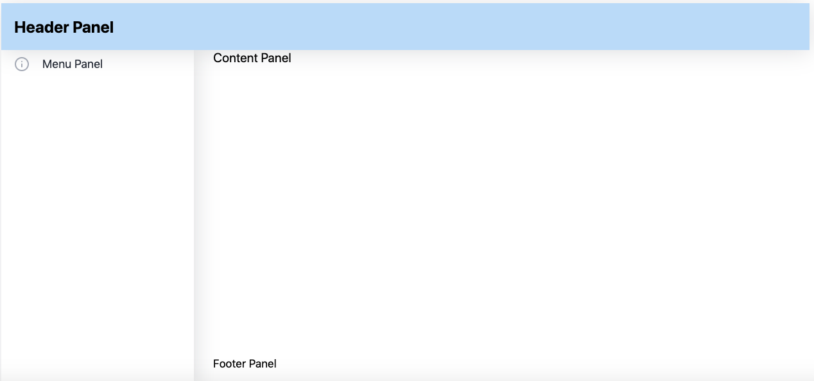

# Golgi WebComponent Library, Implementing the SBAdmin User Interface
 
Rob Tweed <rtweed@mgateway.com>  
21 February 2023, M/Gateway Developments Ltd [http://www.mgateway.com](http://www.mgateway.com)  

Twitter: @rtweed

Google Group for discussions, support, advice etc: [http://groups.google.co.uk/group/enterprise-web-developer-community](http://groups.google.co.uk/group/enterprise-web-developer-community)

# About This Repository

This repository contains a library of [Golgi](https://github.com/robtweed/golgi) WebComponents that
can be used as building blocks to implement user interfaces inspired by the
[SBAdmin](https://themewagon.com/themes/free-bootstrap-5-admin-template-sb-admin/) User Interface model.

# Dependencies

This Component Library has three dependencies, all of which are Open Source:

- [Golgi](https://github.com/robtweed/golgi)
- [The Bootstrap 5 Runtime](https://getbootstrap.com/)
- [The Feather icon library](https://feathericons.com/)

Note that the *golgi-sbadmin* WebComponents use Shadow DOM and are therefore self-contained in terms of styling,
so the standard Bootstrap 5 stylesheet is not needed.

# Check it Out

See the [*/example*](./example) folder in this repository.

You'll find a fully worked example that you can copy to your Web Server.

Alternatively, 
[run the example live, directly from this repository](https://robtweed.github.io/golgi-sbadmin/example/index.html). 

# Overview of the SBAdmin User Interface

The SBAdmin User Interface is built around a core set of panels:

- a Title/Header panel
- a Footer panel
- a left-hand Menu panel
- a right-hand Main Content panel in which the content related to a specific menu option is displayed

Here's a minimal example of how they appear in a browser:

The Panels are used as follows:

## The Title/Header Panel

This panel is mostly used to display a title and/or information text related to the application

## The Footer Panel

This panel is usually used to display copyright, version or other application-specific information

## The Left-Hand Menu Panel

This panel will contain an expandable, multi-level menu of action choices for the user to select.

The *golgi-sbadmin* library contains a suite of pre-built Components that allow you to create your
own multi-level, automatically expanding and contracting menu, for use within this Left-Hand Menu Panel.

## The Main Content Panel

When the user selects an option from the left-hand menu, the associated content for that option will appear 
in the Main Content Panel.

Each time a new left-hand Menu option is chosen by the user, the Main Content Panel is switched to display the new
associated content.  The previously-selected content is still maintained withing the Content Panel, but is
automatically hidden using CSS.  Reselecting a previously-selected option will hide the current Content block and re-show
the previously hidden Content Block, using a simple CSS switch.  All of this show/hide switching behaviour is
built-into the *golgi-sdbamin* Components.

# Additional User Interface Features

The *golgi-sbadmin* Module Library includes a number of other WebComponents that you can use within
your specific application user interface:

- a modal panel, typically used for initial user login

- pre-styled form Components for each of the standard HTML form elements, along with automatic collation of
the form element values as JSON in the top-level Form Component.

# Getting Started

Golgi-based applications do not require any bundling/compilation step or complex build-chain tooling: they are designed to dynamically fetch what's needed when needed by making use of JavaScript ES6 Modules.

So all you need is a web server to which you can upload files and you're good to go.

Now take this [*Getting Started*](/GETTING_STARTED.md) tutorial.

# *golgi-sbadmin* Component Design and Construction

Each *golgi-sbadmin* WebComponent has been authored using 
[Golgi's shortcut syntax](https://github.com/robtweed/golgi/blob/master/SERVER-SIDE-TOOLS.md#the-golgi-component-source-template)
 which avoids the inclusion of repetitive WebComponent Boilerplate code.  Instead, just the core logic and markup of each WebComponent is defined in a JSON file, and the 
[Golgi Server-Side Code Generator](https://github.com/robtweed/golgi/blob/master/SERVER-SIDE-TOOLS.md#compilebuild-your-golgi-components) 
can be used to create a fully-fledged, but minified, WebComponent from each file.

The Golgi Server-Side code generator also generates an optional single JavaScript Module file that combines all your minified Golgi Components into a single downloadable file, which significantly improves startup times to near instantaneous levels.

So, if you're interested in viewing the core logic of each of the *golgi-sbadmin* WebComponents, take a look in this repository's [/components_src](/components_src) folder.  Each WebComponent in this folder is defined as a JavaScript object with the following properties:

        {
          name: '{{Component Name}}',
          useShadowDOM: {{true | false}},  // defaults to false if not specified
          css: `  {{ The Component's style-sheet if ShadowDOM is used }} `,
          html: ` {{ The Component's markup }} `,
          methods: ` {{ The Component's methods (excluding ones automatically added by Golgi }} `
        }

The run-time versions of the *golgi-sbadmin* WebComponents are to be found in the [/components](/components)
folder.  You'll see that each WebComponent in this folder is minified for optimal loading.  You'll also find a file named
[*golgi-components.js*](/components/golgi-components.js) which is a single downloadable file containing all the
minified *golgi-sbadmin* WenComponents.

# Component Reference

## 

# License

 Copyright (c) 2023 M/Gateway Developments Ltd,                           
 Redhill, Surrey UK.                                                      
 All rights reserved.                                                     
                                                                           
  http://www.mgateway.com                                                  
  Email: rtweed@mgateway.com                                               
                                                                           
                                                                           
  Licensed under the Apache License, Version 2.0 (the "License");          
  you may not use this file except in compliance with the License.         
  You may obtain a copy of the License at                                  
                                                                           
      http://www.apache.org/licenses/LICENSE-2.0                           
                                                                           
  Unless required by applicable law or agreed to in writing, software      
  distributed under the License is distributed on an "AS IS" BASIS,        
  WITHOUT WARRANTIES OR CONDITIONS OF ANY KIND, either express or implied. 
  See the License for the specific language governing permissions and      
   limitations under the License. 
